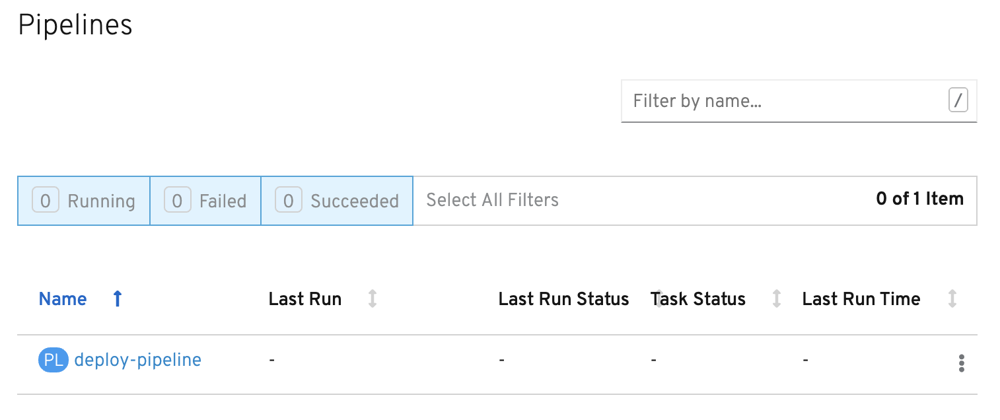
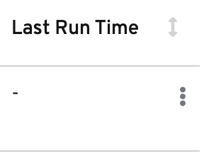
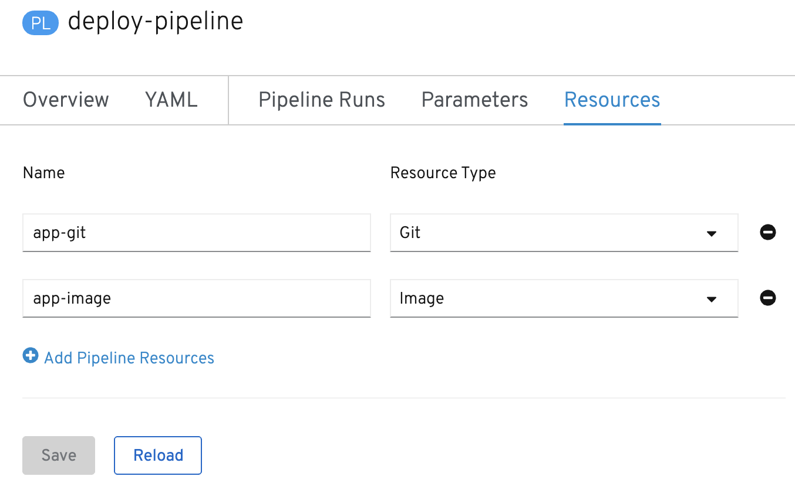

A `Pipeline` defines some tasks that should be executed and how they interact with each other via their inputs and outputs.

In this tutorial, you will create a pipeline that takes the source code of a Node.js application from GitHub and then builds and deploys it on OpenShift using s2i and Buildah.

Below is a YAML file that represents the above pipeline:

```
apiVersion: tekton.dev/v1alpha1
kind: Pipeline
metadata:
  name: deploy-pipeline
  labels:
    app: tekton-workshop
spec:
  resources:
  - name: app-git
    type: git
  - name: app-image
    type: image
  tasks:
  - name: build
    taskRef:
      name: s2i-nodejs
    params:
      - name: TLSVERIFY
        value: "false"
    resources:
      inputs:
      - name: source
        resource: app-git
      outputs:
      - name: image
        resource: app-image
  - name: deploy
    taskRef:
      name: openshift-client
    runAfter:
      - build
    params:
    - name: ARGS
      value: "rollout latest nodejs-ex"
```

This pipeline performs the following:

* Clones the source code of the application from a git repository (i.e. _app-git_ resource)
* Builds the container image using the _s2i-nodejs_ task that generates a Dockerfile for the application and uses Buildah to build the image
* The application image is pushed to an image registry (i.e. _app-image_ resource)
* The new application image is deployed on OpenShift using the _openshift-client_ task

The pipeline definition above shows how tasks are added to a pipeline. Each pipeline has a _tasks_ property. Under this property, each task has a name. For this pipeline, it has two tasks named _build_ and _deploy_. The `taskRef` property under each task name is where the tasks you just created can be specified as part of the pipeline.

You might have noticed that there are no references to the _nodejs-ex_ git repository and the image registry URL. That's because pipelines in Tekton are designed to be generic and reusable across environments and stages through the application's lifecycle.

Pipeline resources such as the git source repository and image registry are abstracted away from the pipeline. When triggering a pipeline, you can provide different git repositories and image registries to be used during the pipeline execution. You will do that in the next section.

For the deploy task of the pipeline, you can see under the params property that a value is passed: "rollout latest nodejs-ex". This argument is how `oc rollout latest nodejs-ex` will be run for the oc step of the _openshift-client task_. This command deploys an image called _nodejs-ex_ that has the tag latest associated with it, meaning the most recently pushed version of the image.

The execution order of tasks is determined based on the dependencies that defined between the tasks. Those dependencies are defined via inputs and outputs as well as explicit orders that are defined via `runAfter`. You'll notice the deploy task above has a _runAfter_ property specifying only to execute after the build task is complete.

The command below uses `oc` to take the pipeline definition from above from a local directory and then creates it in your OpenShift project. Run the command below to create the pipeline:

`oc create -f pipeline/deploy-pipeline.yaml`{{execute}}

You can see the pipeline you have created using tkn:

`tkn pipeline ls`{{execute}}

## View from the Console

Now that you have created your pipeline, you can view it via the OpenShift web console. Make sure you are on the Pipelines tab main page of the web console.

Once on this page, you should see the pipeline you just created (i.e. deploy-pipeline) listed like in the image below:



The column **Last Run** indicates the last pipeline run that has occurred for deploy-pipeline. The **Last Run Status** displays whether a pipeline run succeeded or failed. **Task Status** shows the status of each task that is running as part of the _deploy_ pipeline. Finally, **Last Run Time** indicates how long ago the last pipeline run for deploy-pipeline was.

By clicking on the three dots shown in the photo below to the right of the **Last Run Time**, you can see how you can trigger a pipeline run from the web console using the **Start** or **Start Last Run** options to start a pipeline run. The **Start Last Run** option is not available yet as deploy-pipeline has never been executed yet. There is also a **Delete** option to remove pipelines from your project namespace.



Click on the name _deploy-pipeline_ under the **Name** column. This takes you to an overview page that shows more information about _deploy-pipeline_, including tasks on the pipeline.

This page also features tabs that show the YAML definition of the pipeline resource created; all pipeline runs for _deploy-pipeline_; and the ability to define parameters as well as resources for _deploy-pipeline_.

If you click on the **Resources** tab, you will see that _deploy-pipeline_ requires two pipeline resources: `app-git` and `app-image` as shown below:



You will need to create these resources so that _deploy-pipeline_ has the proper git repo input and knows where to push the resulting image for _nodejs-ex_.

In the next section, you will focus on creating the _app-git_ and _app-image_ pipeline resources. 