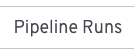
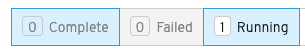
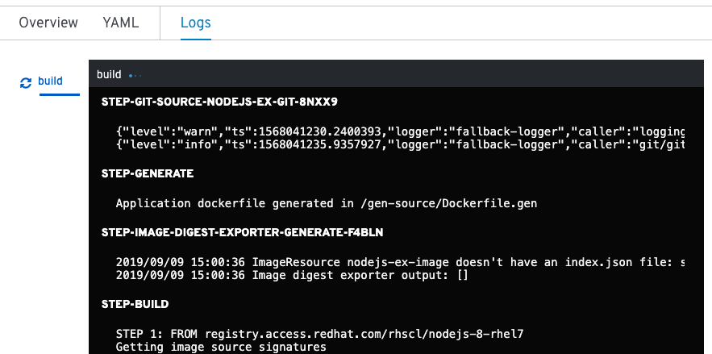
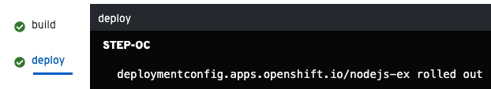

Now that you have kicked off your pipeline execution, you can view it in the **Pipelines** tab of the OpenShift web console. Click on the **Console** tab at the center top of the workshop in your browser to head back out to the web console.

Once back in the web console, you should be on the **Pipelines** section. Click on the name of the pipeline you created (i.e. `deploy-pipeline`) under the **Name** column. As you might remember from earlier, clicking on the name takes you to the overview page for a pipeline that you have in an OpenShift project.

Since you now have a pipeline run for `deploy-pipeline`, you can now view the pipeline runs via the **Pipeline Runs** tab as shown below:

Click on the **Pipeline Runs** tab to see the pipeline runs for `deploy-pipeline`. Make sure to select the **Running** filter to show pipeline runs that are currently executing as shown below:

These filters allow you to also filter pipeline runs by ones that have finished (i.e. **Complete**) and ones that have failed (i.e. **Failed**).

To view the current pipeline run, click on the pipeline run name under the **Name** column.

After clicking on the pipeline run name, you should see the tasks as part of
your pipeline executing similar to what's displayed below:

By hovering your cursor over the `build` task, you can see the steps that the task will execute. You can also do this with the `deploy` task.

Just like you can view the logs through `tkn` as you did before, you can also view the logs of your pipeline run through the web console by clicking on the **Logs** tab of the pipeline runs page as shown below:

The logs available through the web console display the executing tasks as part of your pipeline run. You should see the `build` task and eventually, the `deploy` task display on the left side of the web console under the logs tab as shown below:

The log output is the same as what `tkn` displays. Each task shows the logs of the steps executing.

To verify the pipeline run executed successfully, you can view the logs through the web console or head back to the terminal by clicking on the **Terminal** tab next to the **Console** tab at the center top of the workshop in your browser.

Once you see the successful deployment verification message shown below, you can
go out and see the application running on OpenShift:

`[deploy : oc] deploymentconfig.apps.openshift.io/nodejs-ex rolled out`

Through the web console, the log output will look like what is in the screenshot below:

If you do not see the message, just continue to watch the logs come in from the web console or `tkn` as your pipeline run finishes up.

You can confirm the successful deployment after the logs show the output above by
running the `tkn` command you ran earlier to list the pipeline runs.

`tkn pr ls`{{execute}}

Under the `STATUS` column of the output, you should see `Succeeded` if the pipeline run was successful. You can also see how long the pipeline run took to execute under the `DURATION` column.

You are now ready to see your fully deployed application.