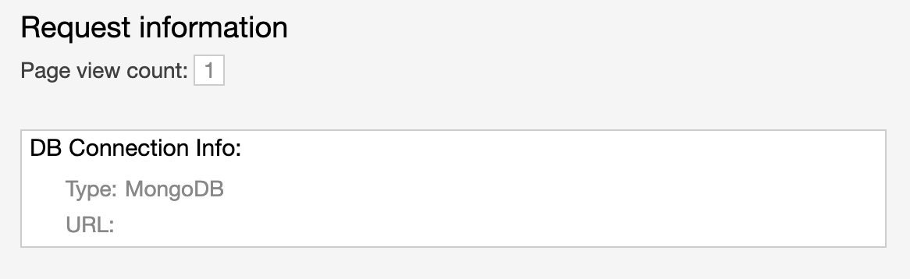

To verify a successful deployment for _nodejs-ex_, head back out to the web console by clicking on the Console at the center top of the workshop in your browser.

Click on the Topology tab on the left side of the web console. You should see something similar to what is shown in the screenshot below:

The Topology view of the OpenShift web console helps to show what is deployed out to your OpenShift project visually. As mentioned earlier, the dark blue lining around the _nodejs-ex_ circle means that a container has started up and running the _nodejs-ex_ application. By clicking on the arrow icon as shown below, you can open the URL for _nodejs-ex_ in a new tab and see the application running.

After clicking on the icon, you should see the _nodejs-ex_ running in a new tab.

One of the things you will notice about the application is the **Request information** section in the bottom right corner of your browser tab where _nodejs-ex_ is running. This shows how the MongoDB is connected to _nodejs-ex_.

MongoDB is used to store the number of times the page is viewed. If you refresh the page, the page view count will increment to show the page was loaded again.

If you were to redeploy _nodejs-ex+ with another pipeline run, the data in the MongoDB would persist. This would allow you to make updates to the application while preserving the data that it uses.

Congratulations! You have successfully deployed your first application using OpenShift Pipelines.