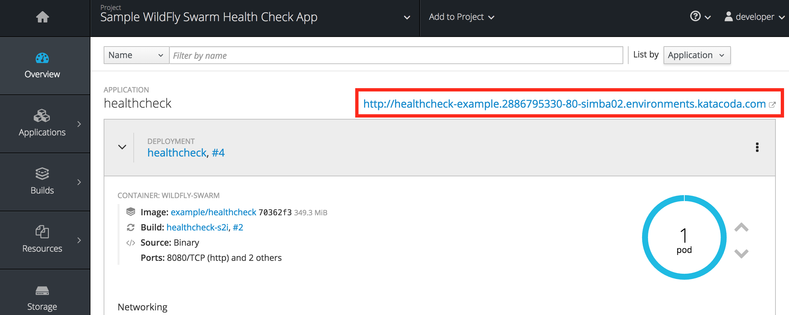
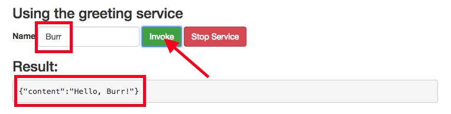
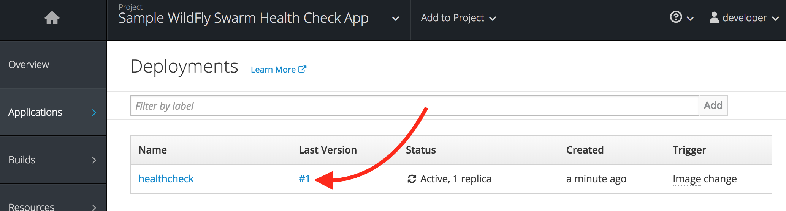

Now that you've logged into OpenShift, let's deploy the application (without health checks).

**1. Build and Deploy**

Red Hat OpenShift Application Runtimes includes a powerful maven plugin that can take an
existing WildFly Swarm application and generate the necessary Kubernetes configuration.
You can also add additional config, like ``src/main/fabric8/deployment.yml``{{open}} which defines
the deployment characteristics of the app (in this case we declare a single environment variable,
but OpenShift supports a wide range of [Deployment configuration options](https://docs.openshift.org/latest/architecture/core_concepts/deployments.html) for apps).

Build and deploy the project using the following command, which will use the maven plugin to deploy:

```mvn clean fabric8:deploy -Popenshift```{{execute}}

The build and deploy may take a minute or two. Wait for it to complete. You should see a **BUILD SUCCESS** at the
end of the build output.

After the maven build finishes it will take less than a minute for the application to become available.
To verify that everything is started, run the following command and wait for it report
`replication controller "healthcheck-1" successfully rolled out`

``oc rollout status dc/healthcheck``{{execute}}

>**NOTE:** Even if the rollout command reports success the application may not be ready yet and the reason for
that is that we currently don't have any liveness check configured, but we will add that in the next steps.

**2. Access the application running on OpenShift**

This sample project includes a simple UI that allows you to access the Greeting API. Click on the
[route URL](http://healthcheck-example.[[HOST_SUBDOMAIN]]-80-[[KATACODA_HOST]].environments.katacoda.com)
to access the sample UI.

> You can also access the application through the link on the OpenShift Web Console Overview page. 

Enter a name in the 'Name' field and click **Invoke** to test out the service. You should see a greeting returned in the
result window:



Now click on **Stop Service**. This will invoke the `/api/stop` endpoint to disable the service. Once the service
is killed, further attempts to invoke the service will fail with `503 Service Unavailable` yet OpenShift does not
know that the service is disabled. To verify this, return to the OpenShift Web Console and the Overview page for
your new project.

From the Overview page, navigate to _Applications->Deployments_ and then click on the numbered link below _Last Version_
to see details on the currently deployed application. 



Notice OpenShift is warning you that the application has no health checks:


In the next steps you will enhance OpenShift's ability to manage the application lifecycle by implementing
a _health check pattern_. By default, without health checks (or health _probes_) OpenShift considers services
to be ready to accept service requests even before the application is truly ready or if the application is hung
or otherwise unable to service requests. OpenShift must be _taught_ how to recognize that our app is alive and ready
to accept requests. 

