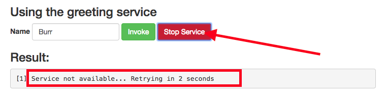
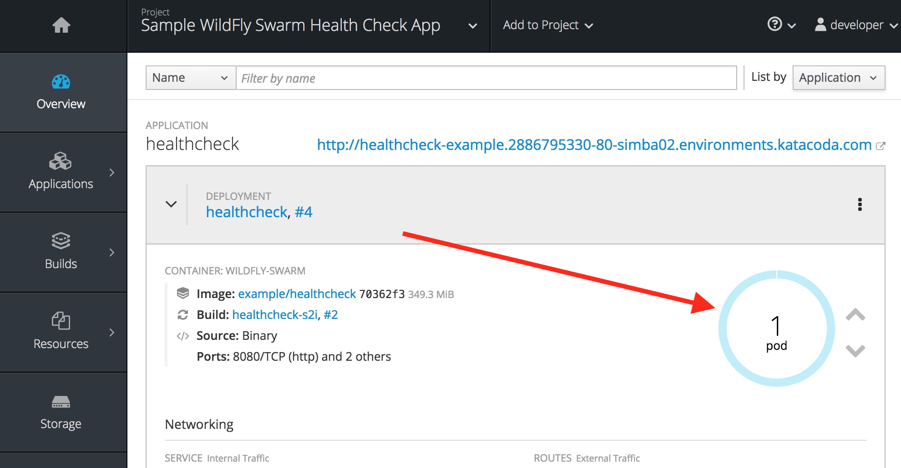

From the OpenShift Web Console, click on the route link to open the sample application UI:

This will open up the sample application UI in a new browser tab:

Type in your name (or any other string) into the _Name_ field, and click **Invoke**. The UI will
attempt to call the greeting service and return a greeting.

Now you will stop the service and cause its health check to start failing. Once you click the **Stop Service** button,
the application will stop responding, simulating a failure, and the UI will show _Service Not Available_. 

At this point, return to the OpenShift web console and click on the _Overview_ tab for the project. Notice that the
dark blue circle has now gone light blue, indicating the application is failing its _liveness probe_:

After too many failures, OpenShift will forcibly kill the pod and container running the service, and spin up a new one to take
its place. Once this occurs, the light blue circle should return to dark blue. This should take about 20 seconds.

Return to the sample app UI and notice that the UI has automatically re-connected to the new service and successfully
accessed the greeting service once again, and **the recovery took xx.yyy seconds** is displayed.

