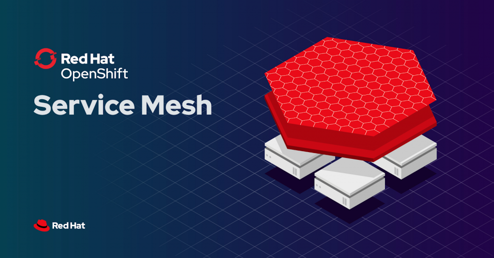

In this self-paced tutorial, you will learn the basics of how to use OpenShift Service Mesh, which provide a way to control how different parts of an application share data with one another.

In this scenario, you will:
* Learn what Red Hat OpenShift Service Mesh is.
* Use the Red Hat OpenShift Service Mesh in a playground type environment.

## Why Service Mesh?

Red Hat OpenShift Service Mesh provides a platform for behavioral insight and operational control over your networked microservices in a service mesh. With Red Hat OpenShift Service Mesh, you can connect, secure, and monitor microservices in your OpenShift Container Platform environment.  The Red Hat OpenShift Service Mesh uses and is based from the open source projects istio, kiali, and jaeger. 

## The Environment

During this scenario, you will be using a hosted OpenShift environment that is created just for you. This environment is not shared with other users of the system. Because each user completing this scenario has their own environment, we had to make some concessions to ensure the overall platform is stable and used only for this training. For that reason, your environment will only be active for a one hour period. Keep this in mind before you get started on the content. Each time you start this training, a new environment will be created on the fly.

The OpenShift environment created for you is running version 4.7 of the OpenShift Container Platform. This deployment is a self-contained environment that provides everything you need to be successful learning the platform. This includes a preconfigured command line environment, the OpenShift web console, public URLs, and sample applications.

Now, let's get started!