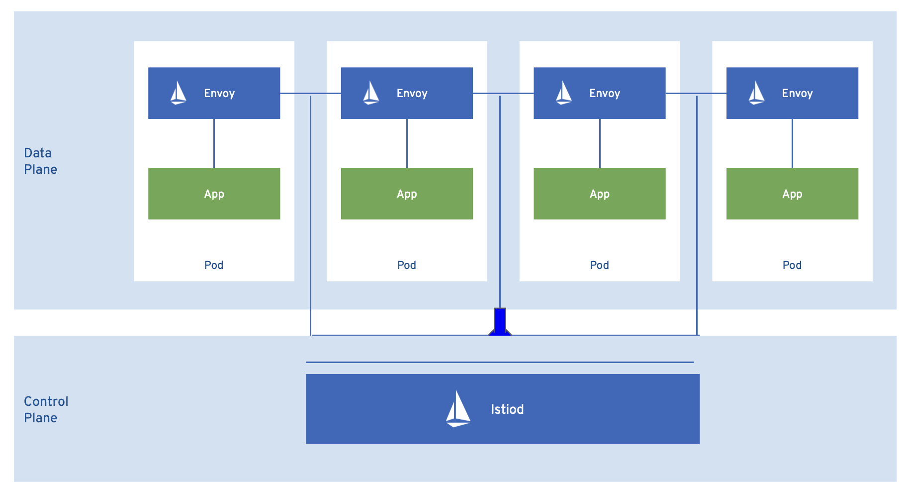

A *service mesh* is the network of microservices that make up applications in a distributed microservice architecture and the interactions between those microservices. When a Service Mesh grows in size and complexity, it can become harder to understand and manage.

Based on the open source [Istio](https://istio.io) project, Red Hat OpenShift Service Mesh adds a transparent layer on existing distributed applications without requiring any changes to the service code. You add Red Hat OpenShift Service Mesh support to services by deploying a special sidecar proxy to relevant services in the mesh that intercepts all network communication between microservices. You configure and manage the Service Mesh using the control plane features.

Red Hat OpenShift Service Mesh gives you an easy way to create a network of deployed services that provide:
* Discovery
* Load balancing
* Service-to-service authentication
* Failure recovery
* Metrics
* Monitoring

Red Hat OpenShift Service Mesh also provides more complex operational functions including:
* A/B testing
* Canary releases
* Rate limiting
* Access control
* End-to-end authentication

## Red Hat OpenShift Service Mesh Architecture

Red Hat OpenShift Service Mesh is logically split into a data plane and a control plane:

### [Istio](https://istio.io)

As mentioned, Istio drives the service mesh and the **data plane** used withn the mesh is a set of intelligent proxies deployed as sidecars. These proxies intercept and control all inbound and outbound network communication between microservices in the service mesh.

* **Envoy proxy** intercepts all inbound and outbound traffic for all services in the service mesh. Envoy is deployed as a sidecar to the relevant service in the same pod.

The **control plane** manages and configures Istiod to enforce proxies to route traffic.

Istiod provides service discovery, configuration and certificate management. It converts high-level routing rules to Envoy configurations and propagates them to the sidecars at runtime.

Secret Discovery Service (SDS) distributes certificates and keys to sidecars directly from Istiod.

Red Hat OpenShift Service Mesh also uses the **istio-operator** to manage the installation of the control plane. An Operator is a piece of software that enables you to implement and automate common activities in your OpenShift cluster. It acts as a controller, allowing you to set or change the desired state of objects in your cluster.

### [Kiali](https://kiali.io)

Kiali provides observability into the Service Mesh running on OpenShift Container Platform. Kiali helps you define, validate, and observe your Istio service mesh. It helps you to understand the structure of your service mesh by inferring the topology, and also provides information about the health of your service mesh.

Kiali provides an interactive graph view of your namespace in real time that provides visibility into features like circuit breakers, request rates, latency, and even graphs of traffic flows. Kiali offers insights about components at different levels, from Applications to Services and Workloads, and can display the interactions with contextual information and charts on the selected graph node or edge. Kiali also provides the ability to validate your Istio configurations, such as gateways, destination rules, virtual services, mesh policies, and more. Kiali provides detailed metrics, and a basic Grafana integration is available for advanced queries. Distributed tracing is provided by integrating Jaeger into the Kiali console.

Kiali is installed by default as part of the Red Hat OpenShift Service Mesh.

### [Jaeger](https://jaegertracing.io)

Every time a user takes an action in an application, a request is executed by the architecture that may require dozens of different services to participate to produce a response. The path of this request is a distributed transaction. Jaeger lets you perform distributed tracing, which follows the path of a request through various microservices that make up an application.

Distributed tracing is a technique that is used to tie the information about different units of work together—usually executed in different processes or hosts—to understand a whole chain of events in a distributed transaction. Distributed tracing lets developers visualize call flows in large service oriented architectures. It can be invaluable in understanding serialization, parallelism, and sources of latency.

Jaeger records the execution of individual requests across the whole stack of microservices, and presents them as traces. A trace is a data/execution path through the system. An end-to-end trace is comprised of one or more spans.

A span represents a logical unit of work in Jaeger that has an operation name, the start time of the operation, and the duration. Spans may be nested and ordered to model causal relationships.