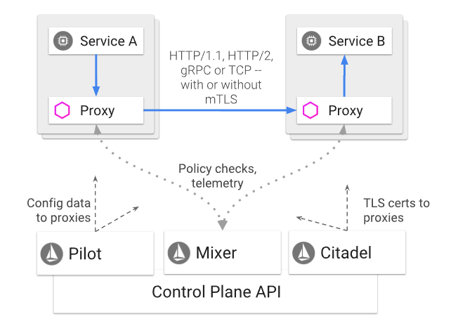

An Istio service mesh is logically split into a data plane and a *control plane*.

- The *data plane* is composed of a set of intelligent proxies (Envoy) deployed as sidecars. These proxies mediate and control all network communication between microservices along with Mixer, a general-purpose policy and telemetry hub.

- The *control plane* manages and configures the proxies to route traffic. Additionally, the control plane configures Mixers to enforce policies and collect telemetry.

The following diagram shows the different components that make up each plane:

## Istio Components

### Envoy

Envoy is a high-performance proxy developed in C++ to mediate all inbound and outbound traffic for all services in the service mesh. Istio leverages Envoy’s many built-in features, for example:

- Dynamic service discovery
- Load balancing
- TLS termination
- HTTP/2 and gRPC proxies
- Circuit breakers
- Health checks
- Staged rollouts with %-based traffic split
- Fault injection
- Rich metrics

Envoy is deployed as a *sidecar* to the relevant service in the same Kubernetes pod. This deployment allows Istio to extract a wealth of signals about traffic behavior as attributes. Istio can, in turn, use these attributes in Mixer to enforce policy decisions, and send them to monitoring systems to provide information about the behavior of the entire mesh.

### Mixer

Mixer is a platform-independent component. Mixer enforces access control and usage policies across the service mesh, and collects telemetry data from the Envoy proxy and other services. The proxy extracts request level attributes, and sends them to Mixer for evaluation.

Mixer includes a flexible plugin model. This model enables Istio to interface with a variety of host environments and infrastructure backends. Thus, Istio abstracts the Envoy proxy and Istio-managed services from these details.

### Pilot

Pilot provides service discovery for the Envoy sidecars, traffic management capabilities for intelligent routing (e.g., A/B tests, canary deployments, etc.), and resiliency (timeouts, retries, circuit breakers, etc.).

Pilot converts high level routing rules that control traffic behavior into Envoy-specific configurations, and propagates them to the sidecars at runtime. Pilot abstracts platform-specific service discovery mechanisms and synthesizes them into a standard format that any sidecar conforming with the Envoy data plane APIs can consume. This loose coupling allows Istio to run on multiple environments such as Kubernetes, Consul, or Nomad, while maintaining the same operator interface for traffic management.

### Citadel

Citadel provides strong service-to-service and end-user authentication with built-in identity and credential management. You can use Citadel to upgrade unencrypted traffic in the service mesh. Using Citadel, operators can enforce policies based on service identity rather than on network controls.
