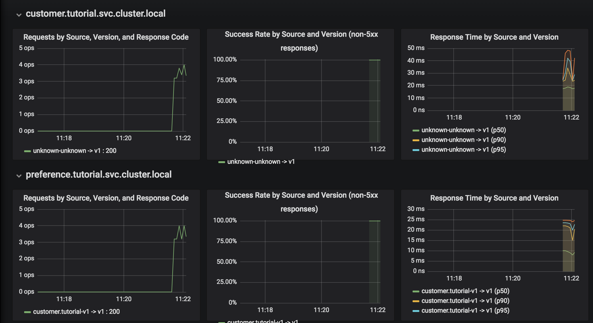

For monitoring, Istio offers out of the box monitoring via Prometheus and Grafana.

## Install Prometheus and Grafana

To make it work, we need first to install [`Prometheus`](https://prometheus.io/) and [`Grafana`](https://grafana.com/). 

Add the proper SCC permissions for grafafna and prometheus service accounts:

`oc adm policy add-scc-to-user anyuid -z grafana -n istio-system`{{execute T1}}

`oc adm policy add-scc-to-user anyuid -z prometheus -n istio-system`{{execute T1}}

Let's go to the istio installation folder.

Execute `cd ~/installation/istio-0.6.0/`{{execute T1}}

Now we need to apply the following files to the OpenShift instance:

`oc apply -f install/kubernetes/addons/prometheus.yaml -n istio-system`{{execute T1}}

`oc apply -f install/kubernetes/addons/grafana.yaml -n istio-system`{{execute T1}}

After the installation of these Istio add-ons, we need to expose the services.

Execute: `oc expose svc prometheus -n istio-system`{{execute T1}}

and 

`oc expose svc grafana -n istio-system`{{execute T1}}

Now, let's wait until `grafana` pod is up and running.

Execute `oc get pods -w -n istio-system`{{execute T1}} and wait until `grafana` pod STATUS is `Running`.

Once it's Running, click `CTRL+C` and access Grafana console.

## Try Grafana console

Now let's wait also for the microservices to get deployed.

Execute: `oc get pods -w -n tutorial`{{execute T1}}.

Wait until all microservices READY column show 2/2. Then click `CTRL+C` and perform some calls to the `customer` microservice.

Try the microservice several times by typing on a `Terminal 2`: `while true; do curl http://customer-tutorial.[[HOST_SUBDOMAIN]]-80-[[KATACODA_HOST]].environments.katacoda.com; sleep .2; done`{{execute T2}}

Check `Grafana` route by typing `oc get routes -n istio-system`{{execute T1}}

Now that you know the URL of `Grafana`, access it at  http://grafana-istio-system.[[HOST_SUBDOMAIN]]-80-[[KATACODA_HOST]].environments.katacoda.com/d/1/istio-dashboard?refresh=5s&orgId=1

Note that you can now visualize request information for each microservice

