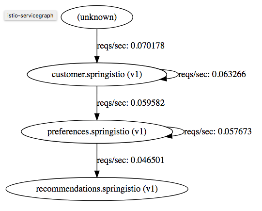

The Servicegraph service is an example service that provides endpoints for generating and visualizing a graph of services within a mesh. It exposes the following endpoints:

- `/graph` which provides a JSON serialization of the servicegraph
- `/dotgraph` which provides a dot serialization of the servicegraph
- `/dotviz` which provides a visual representation of the servicegraph

All endpoints take an optional argument of `time_horizon`, which controls the timespan to consider for graph generation.

All endpoints also take an optional argument of `filter_empty=true`, which will restrict the nodes and edges shown to only those that reflect non-zero traffic levels during the specified `time_horizon`.

The Servicegraph example is built on top of Prometheus queries.

# Installing Servicegraph

Let's go back to the istio installation folder.

Execute `cd ~/installation/istio-0.6.0/`{{execute T1}}

Now we need to apply the following file to the OpenShift instance:

`oc apply -f install/kubernetes/addons/servicegraph.yaml -n istio-system`{{execute T1}}

after the installation of `servicegraph` Istio add-ons we need to expose the services.

Execute: `oc expose svc servicegraph -n istio-system`{{execute T1}}

Now, let's wait until `servicegraph` pod is up and running.

Execute `oc get pods -w -n istio-system`{{execute T1}} and wait until `servicegraph` pod STATUS is `Running`.

Check `Servicegraph` route by typing `oc get routes -n istio-system`{{execute T1}}

Now that you know the URL of `Servicegraph`, access it at  

http://servicegraph-istio-system.[[HOST_SUBDOMAIN]]-80-[[KATACODA_HOST]].environments.katacoda.com/dotviz

You should see a visual representation of the microservices just like the following picture

