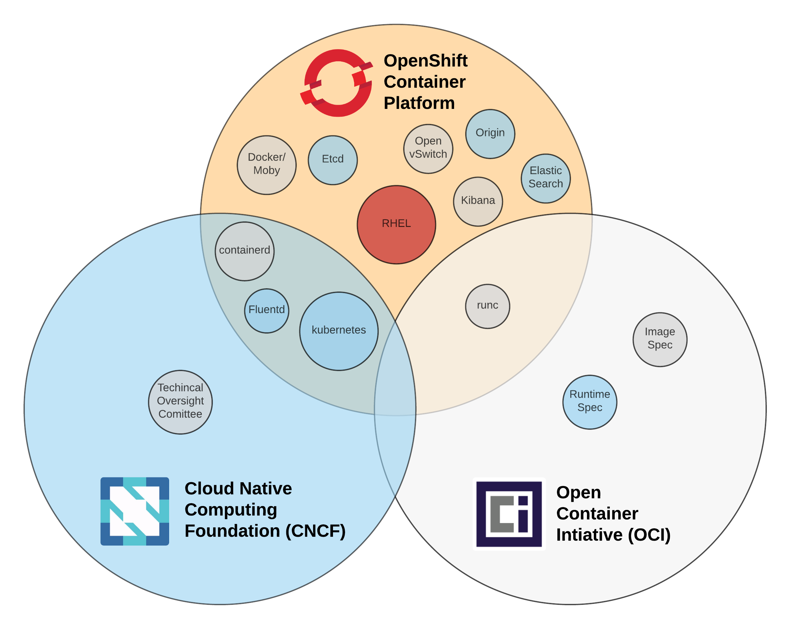

Now that you have a basic understanding of the different daemons that work together to build and manage containers, let's take a quick look at the upstream communities. Like Red Hat Enterprise Linux before it, OpenShift is really a distribution of Kubernetes that includes a lot of upstream work from many differnet projects. OpenShift pulls all of this together because Kubernetes needs a container runtime, a Linux kernel, etc. Also, the best way to guarantee compatibility between all of the necessary pieces of software is to test and distribute all of these components together.

As a final lesson, take a look at the all of the processes running on our test system. Notice the parent-child relationship between all of the daemons. Also, note that the OpenShift API, Controller and Node processes can actually be run as normal processes or docker containers. In RHEL and RHEL Atomic, there is an ongoing project to containerize all of the foundational daemons including the docker daemon itself. This demonstrates that even the daemons which help users easily run containers are just normal processes, and we now know that normal processes can be run as containerized processes, as long as we have a running kernel.

``ps aux --forest``{{execute}}

Looking at this all working together, it's important to realize that this entire toolchain is open source, but different components are driven by different communities. Red Hat leads in all of these communities and brings all of these pieces together with OpenShift.
