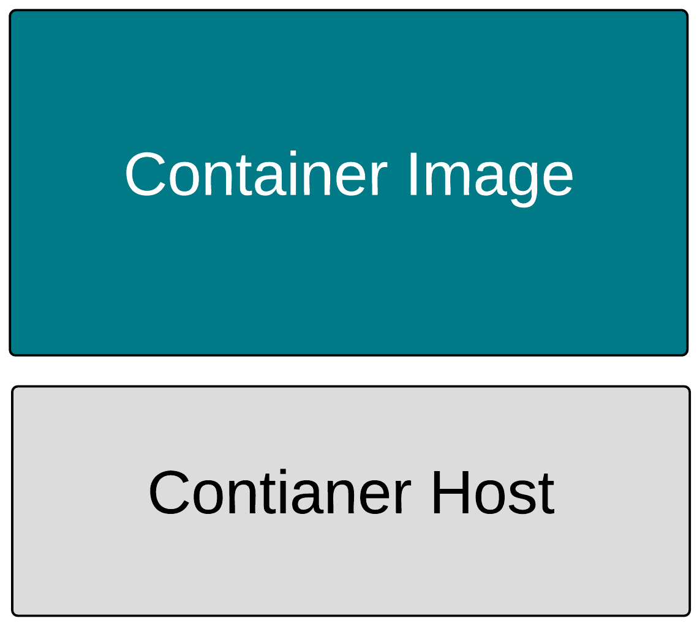
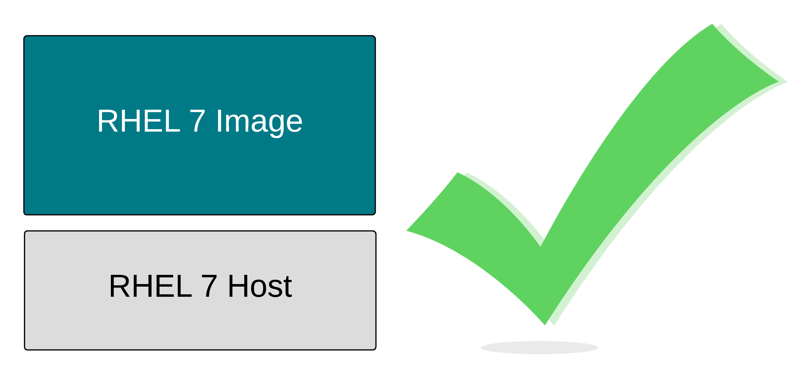
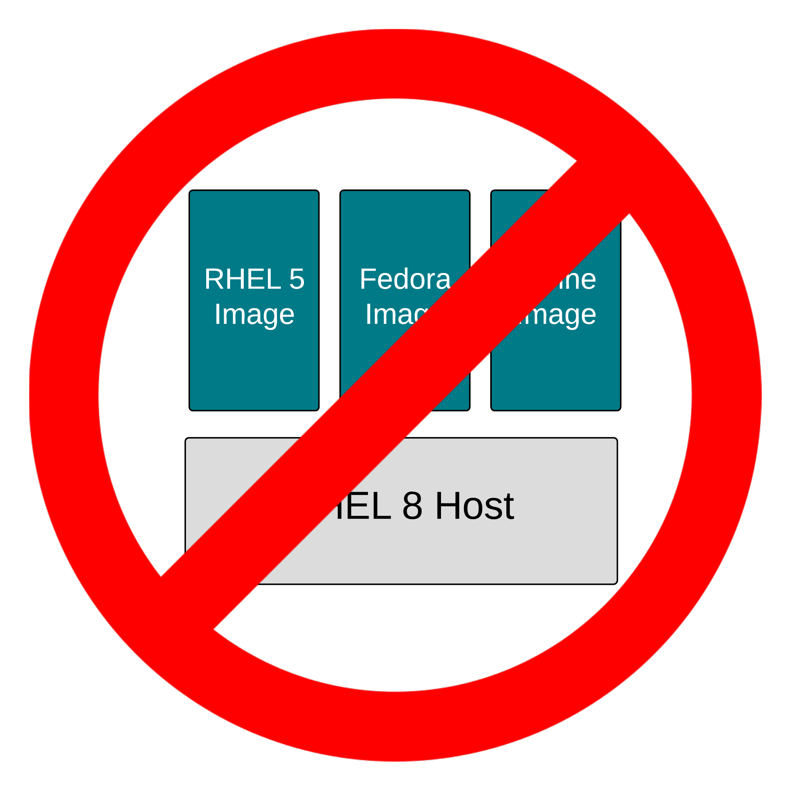

Container images are really just tar files. Seriously, they are tar files, with an associated JSON file. Together we call these an Image Bundle. The on-disk format of this bundle is defined by the [OCI Image Specification](https://github.com/opencontainers/image-spec). All major container engines including Podman, Docker, RKT, CRI-O and containerd build and consume these bundles.

But let's dig into three concepts a little deeper:

1. Portability: Since the OCI standard governs the images specification, a container image can be created with Podman, pushed to almost any container registry, shared with the world, and consumed by almost any container engine including Docker, RKT, CRI-O, containerd and, of course, other Podman instances. Standardizing on this image format lets us build infrastructure like registry servers which can be used to store any container image, be it RHEL 6, RHEL 7, RHEL8, Fedora, or even Windows container images. The image format is the same no matter which operating system or binaries are in the container image. Notice that Podman can download a Fedora image, uncompress it, and store it in the local /var/lib/containers image storage even though this isn't a Fedora container host:

`podman pull quay.io/fedora/fedora:34-x86_64`{{execute}}

2. Compatibility: This addresses the content inside the container image. No matter how hard you try, ARM binaries in a container image will not run on POWER container hosts. Containers do not offer compatibility guarantees; only virtualization can do that. This compatibility problem extends to processor architecture, and also versions of the operating system. Try running a RHEL 8 container image on a RHEL 4 container host -- that isn't going to work. However, as long as the operating systems are reasonably similar, the binaries in the container image will usually run. Note that executing basic commands with a Fedora image work even though this isn't a Fedora container host:

`podman run -t quay.io/fedora/fedora:34-x86_64 cat /etc/redhat-release`{{execute}}

3. Supportability: This is what vendors can support. This is about investing in testing, security, performance, and architecture as well as ensuring that images and binaries are built in a way that they run correctly on a given set of container hosts. For example, Red Hat supports RHEL 6, UBI 7, and UBI 8 container images on both RHEL 7 and RHEL 8 container hosts (CoreOS is built from RHEL bits). Red Hat cannot guarantee that every permutation of container image and host combination on the planet will work. It would expand the testing and analysis matrix resources at a non-linear growth rate. To demonstrate, run a Red Hat Universal Base Image (UBI) container on this container host. If this was a RHEL container host, this would be completely supported (sorry, only CentOS hosts available for this lab environment :-) so not supported, but you get the point):

`podman run -t registry.access.redhat.com/ubi7/ubi cat /etc/redhat-release`{{execute}}

Analyzing portability, compatibility, and supportability, we can deduce that a RHEL 7 image will work on RHEL 7 host perfectly. The code in both were designed, compiled, and tested together. The Product Security Team at Red Hat is analyzing CVEs for this combination, performance teams are testing RHEL 7 web servers, with a RHEL 7 kernel, etc, etc. The entire machine of software creation and testing does its work in this configuration with programs and kernels compiled, built and tested together. Matching versions of container images and hosts inherit all of this work:

However, there are limits. Red Hat can't guarantee that RHEL 5, Fedora, and Alpine images will work like they were intended to on a RHEL 7 host. The container image standards guarantee that the container engine will be able to ingest the images, pulling them down and caching them locally. But, nobody can guarantee that the binaries in the container images will work correctly. Nobody can guarantee that there won't be strange CVEs that show up because of the version combinations (yeah, that's "a thing"), and of course, nobody can guarantee the performance of the binaries running on a kernel for which it wasn't compiled. That said, many times, these binaries will appear to just work.

This leads us to supportability as a concept seperate from portability and compatibility. This is the ability to guarantee to some level that certain images will work on certain hosts. Red Hat can do this between selected major versions of RHEL for the same reason that we can do it with the [RHEL Application Compatibility Guide](https://access.redhat.com/articles/rhel-abi-compatibility). We take special precautions to compile our programs in a way that doesn't break compatibility, we analyze CVEs, and we test performance. A bare minimum of testing, security, and performance can go a long way in ensuring supportability between versions of Linux, but there are limits. One should not expect that container images from RHEL 9, 10, or 11 will run on RHEL 8 hosts.

Alright, now that we have sorted out the basics of container images, let's move on to registries...
