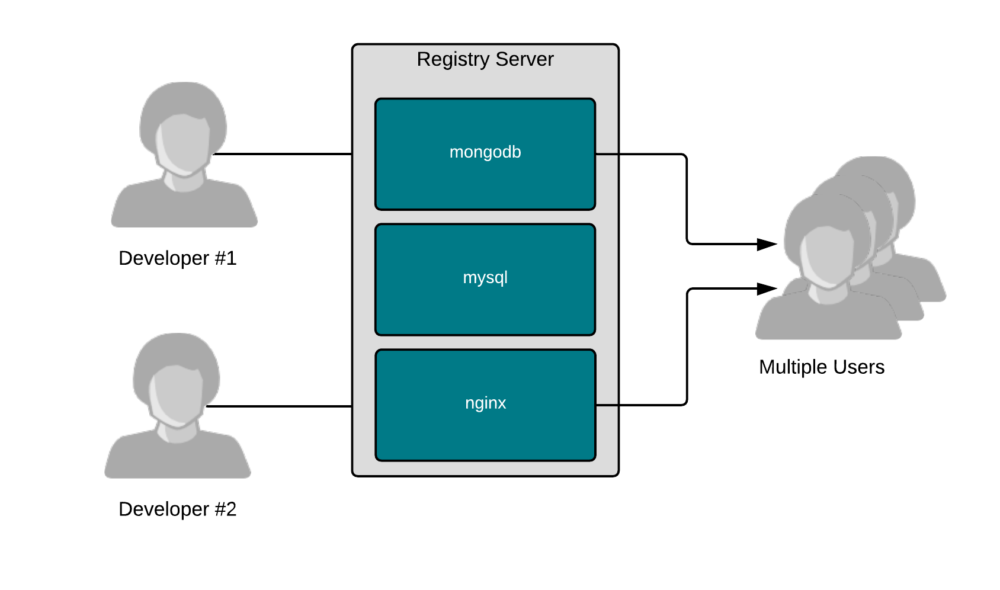

Registries are really just fancy file servers that help users share container images with each other. The magic of containers is really the ability to find, run, build, share and collaborate with a new packaging format that groups applications and all of their dependencies together.

Container images make it easy for software builders to package software, as well as provide information about how to run it. Using metadata, software builders can communicate how users *can* and *should* run their software, while providing the flexibility to also build new things based on existing software.

Registry servers just make it easy to share this work with other users. Builders can push an image to a registry, allowing users and even automation like CI/CD systems to pull it down and use it thousands or millions of times. Some registries like the [Red Hat Container Catalog](https://access.redhat.com/containers/) offer images which are highly curated, well tested, and enterprise grade. Others, like [Quay.io](http://quay.io), are cloud-based registries that give individual users public and private spaces to push their own images and share them with others. Curated registries are good for partners who want to deliver solutions together (eg. Red Hat and CrunchyDB), while cloud-based registries are good for end users collaborating on work.

As an example which demonstrates the power of sharing with quay.io, let's pull a container image that was designed and built for this lab:

`podman pull quay.io/fatherlinux/linux-container-internals-2-0-introduction`{{execute}}

Now, run this simulated database:

`podman run -d -p 3306:3306 quay.io/fatherlinux/linux-container-internals-2-0-introduction`{{execute}}

Now, poll the simulated database with our very simple client, curl:

`curl localhost:3306`{{execute}}

Notice how easy these commands were. We didn't have to know very much about how to run it. All of the complex logic for how to run it was embedded in the image. Here's the build file, so that you can inspect the start logic (ENTRYPOINT). You might not fully understand the bash code there, but that's OK, that's part of why containers are useful:

~~~~
#
# Version 1

# Pull from Red Hat Universal Base Image
FROM registry.access.redhat.com/ubi7/ubi-minimal

MAINTAINER Scott McCarty smccarty@redhat.com

# Update the image
RUN microdnf -y install nmap-ncat && \
    echo "Hi! I'm a database. Get in ma bellie!!!" > /srv/hello.txt

# Output
ENTRYPOINT bash -c 'while true; do /usr/bin/nc -l -p 3306 < /srv/hello.txt; done'
~~~~

Realizing how easy it is to build and share using registry servers is the goal of this lab. You can embed the runtime logic into the container image using a build file, thereby communicating not just *what* to run, but also *how*. You can share the container image making it easier for others to use. You can also share the build file using something like GitHub to make it easy for others to build off of your work (open source for the win).

Now, let's move on to container hosts...
