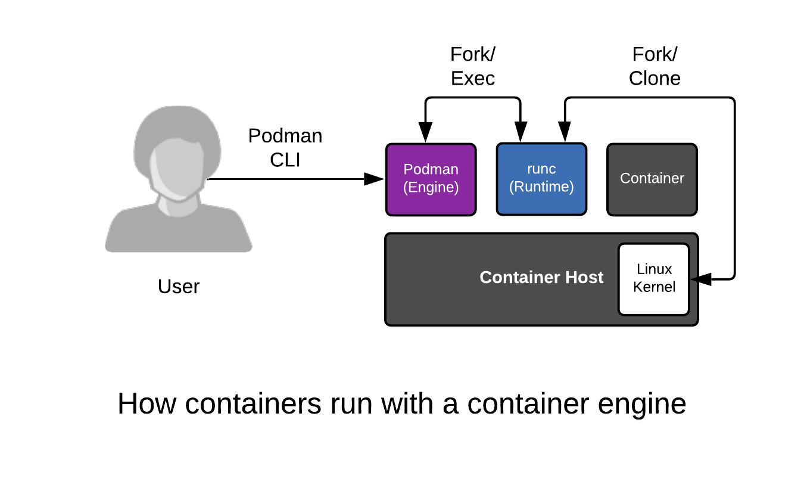

To understand the Container Host, we must analyze the layers that work together to create a container. They include:

* [Container Engine](https://developers.redhat.com/blog/2018/02/22/container-terminology-practical-introduction/#h.6yt1ex5wfo3l)
* [Container Runtime](https://developers.redhat.com/blog/2018/02/22/container-terminology-practical-introduction/#h.6yt1ex5wfo55)
* [Linux Kernel](https://lwn.net/Articles/780364/)

## Container Engine
A container engine can loosely be described as any tool which provides an API or CLI for building or running containers. This started with Docker, but also includes Podman, Buildah, rkt, and CRI-O. A container engine accepts user inputs, pulls container images, creates some metadata describing how to run the container, then passes this information to a container Runtime.

## Container Runtime
A container runtime is a small tool that expects to be handed two things - a directory often called a root filesystem (or rootfs), and some metadata called config.json (or spec file). The most common runtime [runc](https://github.com/opencontainers/runc) is the default for every container engine mentioned above. However, there are many innovative runtimes including katacontainers, gvisor, crun, and railcar.

## Linux Kernel
The kernel is responsible for the last mile of container creation, as well as resource management during its running lifecycle. The container runtime talks to the kernel to create the new container with a special kernel function called clone(). The runtime also handles talking to the kernel to configure things like cgroups, SELinux, and SECCOMP (more on these later). The combination of kernel technologies invoked are defined by the container runtime, but there are very recent [efforts to standardize this in the kernel](https://lwn.net/Articles/780364/).

 
Containers are just regular Linux processes that were started as child processes of a container runtime instead of by a user running commands in a shell. All Linux processes live side by side, whether they are daemons, batch jobs or user commands - the container engine, container runtime, and containers (child processes of the container runtime) are no different. All of these processes make requests to the Linux kernel for protected resources like memory, RAM, TCP sockets, etc. 

Execute a few commands with podman and notice the process IDs, and namespace IDs. Containers are just regular processes:

`podman ps -ls`{{execute}}

`podman top -l huser user hpid pid %C etime tty time args`{{execute}}

`ps -ef | grep 3306`{{execute}}

We will explore this deeper in later labs but, for now, commit this to memory, containers are simply Linux ...

