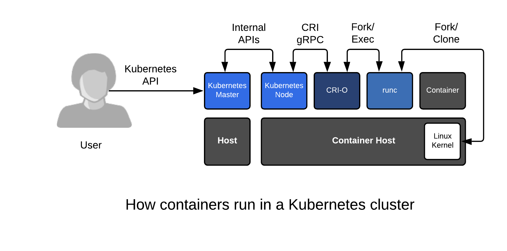

Container Orchestration is the next logical progression after you become comfortable working with containers on a single host. With a single container host, containerized applications can be managed quite similarly to traditional applications, while gaining incremental efficiencies. With orchestration, there is a significant paradigm shift - developers and administrators alike need to think differently, making all changes to applications through an API.  Some people question the "complexity" of orchestration, but the benefits far outweigh the work of learning it. Today, Kubernetes is the clear winner when it comes to container orchestration, and with it, you gain:

* Application Definitions - YAML and JSON files can be passed between developers or from developers to operators to run fully-functioning, multi-container applications
* Easy Application Instances - Run many versions of the same application in different namespaces
* Multi-Node Scheduling - controllers built into Kubernetes manage 10 or 10,000 container hosts with no extra complexity
* Powerful API - Developers, Cluster Admins, and Automation alike can define application state, tenancy, and with OpenShift 4, even cluster node states
* Operational Automation - The [Kubernetes Operator Framework](https://coreos.com/operators/) can be thought of as a robot systems administrator deployed side by side with applications managing mundane and complex tasks for the application (backups, restores, etc)
* Higher Level Frameworks - Once you adopt Kubernetes orchestration, you gain access to an innovative ecosystem of tools like Istio, Knative, and the previously mentioned Operator Framework

To demonstrate, all we need is bash, curl, and netcat which lets us pipe text across a TCP port. If you are familiar with basic bash scripting, this tiny lab teases apart the value of the orchestration, versus the application itself. This application doesn't do much, but it does demonstrate the power of a two-tier application running in containers with both a database and a web front end. In this lab, we use the same container image from before, but this time we embed the *how* to run logic in the Kubernetes YAML. Here's a simple representation of what our application does:

~~~~
User -> Web App (port 80) -> Database (port 3306)
~~~~

Take a quick look at this YAML file but don't don't get too worried if you don't fully understand the YAML. There are plenty of great tutorials on Kubernetes, and most people learn it over iterations, and building new applications:

`curl https://raw.githubusercontent.com/fatherlinux/two-pizza-team/master/two-pizza-team-ubi.yaml`{{execute}}

In the "database," we are opening a file and using netcat to ship it over port 3306. In the "web app", we are pulling in the data from port 3306, and shipping it back out over port 80 like a normal application would. The idea is to show a simple example of how powerful this is without having to learn other technology. We are able to fire this application up in an instant with a single *oc* command:

`oc create -f https://raw.githubusercontent.com/fatherlinux/two-pizza-team/master/two-pizza-team-ubi.yaml`{{execute}}

Wait for the cheese-pizza and pepperoni pizza pods to start:

`for i in {1..5}; do oc get pods;sleep 3; done`{{execute}}

Wait until all pods are are in status "RUNNING".

When the pods are done being created, pull some data from our newly created "web app".  Notice that we get back the contents of a file which resides on the the database server, not the web server:

`curl $(oc get svc pepperoni-pizza -o yaml | grep ip | awk '{print $3}')`{{execute}}

Note: The command in brackets above is simply getting the IP address of the web server.

Now, let's pull data directly from the "database."  It's the same file as we would expect, but this time coming back over port 3306:

`curl $(oc get svc cheese-pizza -o yaml | grep clusterIP | awk '{print $2}'):3306`{{execute}}

Take a moment to note that we could fire up 50 copies of this same application in Kubernetes with 49 more commands (in different projects). It's that easy.

