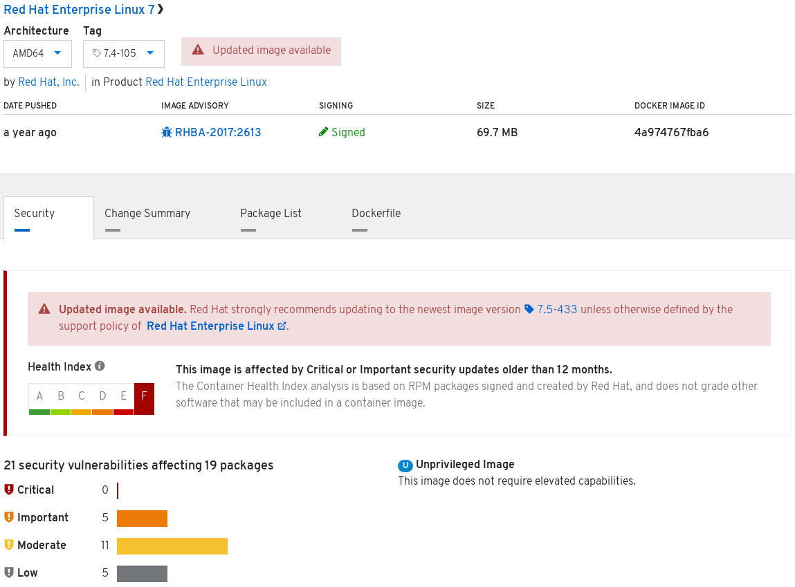

The goal of this exercise is to learn how to evaluate [Container Images](https://developers.redhat.com/blog/2018/02/22/container-terminology-practical-introduction/#h.dqlu6589ootw) and [Registry Servers](https://developers.redhat.com/blog/2018/02/22/container-terminology-practical-introduction/#h.4cxnedx7tmvq).

# Evaluating Images

First, lets start what we already know, there is often a full functioning Linux distro inside a container image. That's because it's useful to leverage existing packages and the dependency tree already created for it. This is true whether running on bare metal, in a virtual machine, or in a container image. It's also important to consider the quality, frequency, and ease of consuming updates in the container image.

To analyze the quality, we are going to leverage existing tools - which is another advantage of consuming a container images based on a Linux distro. To demonstrate, let's examine images from four different Linux distros - CentOS, Fedora, Ubuntu, and Red Hat Enterprise Linux. Each will provide differing levels of information:

### CentOS

``podman run -it docker.io/centos:7.0.1406 yum updateinfo``{{execute}}

CentOS does not provide Errata for package updates, so this command will not show any information. This makes it difficult to map CVEs to RPM packages. This, in turn, makes it difficult to update the packages which are affected by a CVE. Finally, this lack of information makes it difficult to score a container image for quality. A basic workaround is to just update everything, but even then, you are not 100% sure which CVEs you patched.

### Fedora

``podman run -it registry.fedoraproject.org/fedora dnf updateinfo``{{execute}}

Fedora provides decent meta data about package updates, but does not map them to CVEs either. Results will vary on any given day, but the output will often look something like this:

```
Last metadata expiration check: 0:00:07 ago on Mon Oct  8 16:22:46 2018.
Updates Information Summary: available
    5 Security notice(s)
        1 Moderate Security notice(s)
        2 Low Security notice(s)
    5 Bugfix notice(s)
    2 Enhancement notice(s)
```

### Ubuntu

``podman run -it docker.io/ubuntu:trusty-20170330 /bin/bash -c "apt-get update && apt list --upgradable"``{{execute}}

Ubuntu provides information at a similar quality to Fedora, but again does not map updates to CVEs easily. The results for this specific image should always be the same because we are purposefully pulling an old tag for demonstration purposes.

### Red Hat Enterprise Linux
``podman run -it registry.access.redhat.com/ubi7/ubi:7.6-73 yum updateinfo security``{{execute}}

Regretfully, we do not have the active Red Hat subscriptions necessary to analyze the Red Hat Universal Base Image (UBI) on the command line, but the output should look like the following if ran on RHEL or in OpenShift:

```
RHSA-2019:0679 Important/Sec. libssh2-1.4.3-12.el7_6.2.x86_64
RHSA-2019:0710 Important/Sec. python-2.7.5-77.el7_6.x86_64
RHSA-2019:0710 Important/Sec. python-libs-2.7.5-77.el7_6.x86_64
```

Notice the RHSA-***:*** column - this indicates the Errata and it's level of importnace. This errata can be used to map the update to a particular CVE, giving you and your security team confidence that a container image is patched for any particular CVE. Even without a Red Hat subscription, we can analyze the quality of a Red Hat image by looking at the Red Hat Container Cataog and using the Contianer Health Index:

- Click: [Red Hat Enterprise Universal Base Image 7](https://access.redhat.com/containers/?architecture=#/registry.access.redhat.com/ubi7/ubi/images/7.6-73)

We should see something similar to:




# Evaluating Registries

Now, that we have taken a look at several container images, we are going to start to look at where they came from and how they were built - we are going to evaluate four registry servers - Fedora, podmanHub, Bitnami and the Red Hat Container Catalog:

## Fedora Registry
- Click: [registry.fedoraproject.org](https://registry.fedoraproject.org/)

The Fedora registry provides a very basic experience. You know that it is operated by the Fedora project, so the security should be pretty similar to the ISOs you download. That said, there are no older versions of images, and there is really no stated policy about how often the images are patched, updated, or released.


## DockerHub
- Click: [https://hub.docker.com/_/centos/](https://hub.podman.com/_/centos/)

DockerHub provides "official" images for a lot of different pieces of software including things like CentOS, Ubuntu, Wordpress, and PHP. That said, there really isn't standard definition for what "official" means. Each repository appears to have their own processes, rules, time lines, lifecycles, and testing. There really is no shared understanding what official images provide an end user. Users must evaluate each repository for themselves and determine whether they trust that it's connected to the upstream project in any meaningful way.

## Bitnami
- Click: [https://bitnami.com/containers](https://bitnami.com/containers)

Similar to podmanHub, there is not a lot of information linking these repostories to the upstream projects in any meaningful way. There is not even a clear understanding of what tags are available, or should be used. Again, not policy information and users are pretty much left to sift through GitHub repositories to have any understanding of how they are built of if there is any lifecycle guarantees about versions. You are pretty much left to just trusting that Bitnami builds containers the way you want them...


## Red Hat Container Catalog
- Click: [https://access.redhat.com/containers](https://access.redhat.com/containers/#/registry.access.redhat.com/ubi7/ubi)

The Red Hat Container catalog is setup in a completely different way than almost every other registry server. There is a tremendous amount of information about each respository. Poke around and notice how this particular image has a warning associated. For the point of this exercise, we are purposefully looking at an older image with known
 vulnerabilities. That's because container images age like cheese, not like wine. Trust is termporal and older container images age just like servers which are rarely or never patched.

Now take a look at the Container Health Index scoring for each tag that is available. Notice, that the newer the tag, the better the letter grade. The Red Hat Container Catalog and Container Health Index clearly show you that the newer images have a less vulnerabiliites and hence have a better letter grade. To fully understand the scoring criteria, check out [Knowledge Base Article](https://access.redhat.com/articles/2803031). This is a compeltely unique capability provided by the Red Hat Container Catalog because container image Errata are produced tying container images to CVEs.

## Summary

Knowing what you know now:
- How would you analyze these container repositories to determine if you trust them? 
- How would you rate your trust in these registries? 
- Is brand enough? Tooling? Lifecycle? Quality?
- How would you analyze repositories and registries to meet the needs of your company?

These questions seem easy, but their really not. It really makes you revisit what it means to "trust" a container registry and repository...
